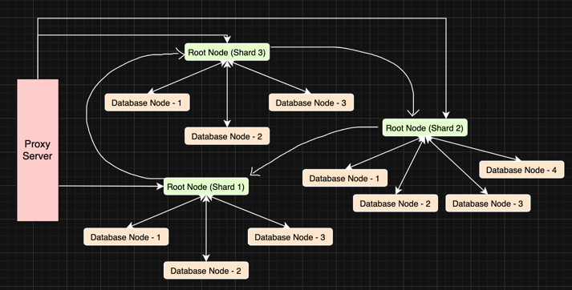

# Distributed Database

## Main Components
- Proxy Server
- Root Node (Shard Coordinator)
- Database Node (Leader / Follower)

## Architecture Overview

### Proxy Server
- Routes client requests to the correct shard using consistent hashing.
- Forwards requests to the appropriate Root Node.
- Monitors Root Node health using heartbeat signals.
- Reroutes requests when a Root Node becomes inactive.
- Resynchronizes data when an inactive Root Node comes back online using neighboring shards.

### Root Node (Shard Coordinator)
- Represents a shard responsible for a specific hash range.
- Receives requests from the Proxy Server.
- Forwards **write** and **delete** operations to the Leader Database Node.
- Distributes **read** operations across Follower Database Nodes using round-robin.
- Monitors Leader health.
- Initiates leader election when the Leader Database Node fails.

### Database Node
- Stores the actual data.
- Operates in one of two roles:
    - **Leader**
        - Handles write and delete operations.
        - Maintains a temporary replication log for recent updates.
        - Replicates data asynchronously to follower nodes.
    - **Follower**
        - Handles read operations.
        - Applies replicated updates from the Leader.
- Every Database Node maintains a **Write-Ahead Log (WAL)** for durability and recovery.
- Periodically synchronizes data with peer nodes within the same shard.

## Configuration Details
- Number of shards is configurable.
- Number of database nodes per shard is configurable.

## System Diagram

